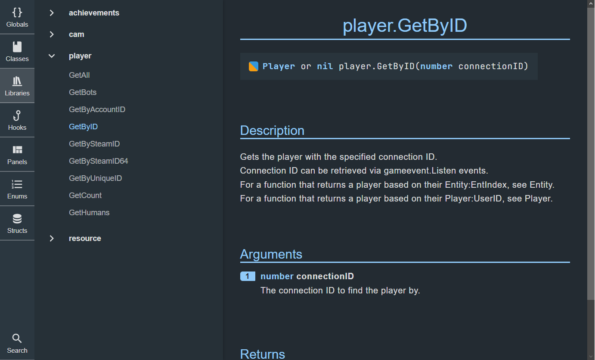

<a name="readme-top"></a>

<div align="center">
  <br/>
   
   
  <p align="center">
   <h2 align="center">gDocs</h2>
   <h3 align="center">A Garry's Mod Lua Documentation Tool<h3>
    <br />
    <a href="https://victorienxp.github.io/gdocs">View Live Demo</a>
    ·
    <a href="issues">Report Bug</a>
    ·
    <a href="projects">Planned Feature</a>
  </p>
</div>

> This is a fork `ruigouveiamaciel/gdocs`, available [here](https://ruigouveiamaciel.github.io/gdocs/#/).

---

## About gDocs



gDocs is a versatile documentation generator for Garry's Mod Lua projects. It streamlines code comprehension with concise interface that supports common features such as:

- arguments listing
- detailed function descriptions
- badge indicators for status (deprecated, internal, stub)
- syntax-highlighted examples
- search functionality
- seamless type linking

It is battery-included, featuring a parser tool and pre-compiled web UI, requiring no external tools or Docker images.

If you want to see examples of docummentation blocks you can check them [here](parser/examples).

> **Notice!** This project in complete rework and existing features might change in the future. Feel free to contribute with ideas and code.

<p align="right">(<a href="#readme-top">top</a>)</p>

## Getting Started

To get started with **gDocs**, download the parser for your architecture from the [releases page](releases).

Next, unzip the web UI zip file into your webpage root directory.

To generate the database, run the parser tool with the command:

```bash
parser.exe -d path_to_gmod_project -o path_to_webpage_root
```

Once the database (`parsed.json`) is generated and placed on the docs root, your documentation is ready to deploy to GitHub Pages or any other hosting provider.

> Alternatively, if you have [Deno](https://deno.com/) installed, you can opt to use the JavaScript version.

<p align="right">(<a href="#readme-top">top</a>)</p>

## CI Usage

The easiest way to get it run on your local machine or anywhere is really to pull the latest parser and run it locally :

```bash
wget https://github.com/VictorienXP/gdocs/releases/download/1.0/docs.zip
wget https://github.com/VictorienXP/gdocs/releases/download/1.0/parser_x86_64-unknown-linux-gnu

unzip -o docs.zip -d docs
chmod +x parser_x86_64-unknown-linux-gnu

./parser_x86_64-unknown-linux-gnu -d src -o docs

# Now you can upload the "docs" to your webserver
# You also can test locally using your favorite webserver. I personally recommands deno file_server for fast testing :
# deno run --allow-net --allow-read="docs" -A -r -q https://deno.land/std/http/file_server.ts --cors --port=8000 docs

```

> Read more about the parser usage [here](parser#usage).

If you CI forces you into Docker usage, you can use the [deno_docker](https://github.com/denoland/deno_docker) base image or the GitHub action's `denoland/setup-deno` :

```yaml
jobs:
   build-and-deploy:
      runs-on: ubuntu-latest
      env:
         GDOCS_VERSION: 1.0
      steps:
         - uses: actions/checkout@v3

         - name: Setup deno
         uses: denoland/setup-deno@v1
         with:
            deno-version: v1.x

         - name: Download gDocs files
            run: |
               wget https://github.com/VictorienXP/gdocs/releases/download/${{ env.GDOCS_VERSION }}/docs.zip
               wget https://github.com/VictorienXP/gdocs/releases/download/${{ env.GDOCS_VERSION }}/parser.min.js

         - name: Extract docs
            run: unzip -o docs.zip -d docs

         - name: Generate database
            run: deno run -A parser.min.js -d src -o docs

         - name: Deploy gh-pages
            uses: peaceiris/actions-gh-pages@v3
            with:
               github_token: ${{ secrets.GITHUB_TOKEN }}
               publish_dir: ./docs

```

For GitLab Pages you can also use the Deno's docker image :

```yaml
generate_docs:
  stage: generate_docs
  image: denoland/deno:1.40.4
  script:
    - wget https://github.com/VictorienXP/gdocs/releases/download/1.0/docs.zip
    - wget https://github.com/VictorienXP/gdocs/releases/download/1.0/parser.min.js
    - unzip -o docs.zip -d docs
    - deno run -A parser.min.js -d src -o docs

deploy:
  stage: deploy
  script:
    - mv docs public
  artifacts:
    paths:
      - public
  only:
    - main
  dependencies:
    - generate_docs
```

<p align="right">(<a href="#readme-top">top</a>)</p>

## Tags Syntax

In gdocs tags follow the following syntax.

- Tags that have no required arguments should have nothing after the tag.
- Tags that require one argument don't require quotes, everything after the tag will be the argument. If quotes are inserted they will be part of the argument.
- Tags that require more than one argument will match one word to an argument, except for the last one which will match everything else just as explained above.
- If you want to provide an argument (that is not the last one) with more than one word you have to surround it by quotes.

#### Example

The following tag expects 3 arguments.

```lua
-- @tagName argument1 argument2 argument3
-- @tagName argument1 "This is the argument 2" This is the argument 3. The last argument doesn't require quotes to have more than one word.
-- @tagName "This is argument one" 'This is argument 2. You can mix quote types.' This is argument 3.

-- @tagName "This is argument
-- 1" "Argument 2" You can break your tag into multiple
-- lines. Line breaks will be replaced by a space.
```

## Documentation Blocks

Documentation blocks must always have `--` on the beggining of the line and can span multiple lines as long the next one also starts with `--`.

Blocks can contain any amount of tags and a description.

Tags must start at the beggining of a line (after the `--`) to be valid.

#### Example

```lua
-- This is a description. The description must always come on top of the
-- documentation block.
--
-- This is a new paragraph, to make a new paragraph separate the text by
-- an empty line.
-- @library Example
-- @clientside

-- This is a function description.
--
-- Because there is a function beneath this block, the tag '@name <function name>'
-- will be added automaticlly, replacing <function name> the the corresponding
-- function name.
--
-- @tparam number a The first number.
-- @tparam number b The second number.
-- @treturn number The addition of the 2 given numbers.
function addition(a, b)
   return a + b
end
```

For more examples check the [examples folder](parser/examples).

## Global Tags

Global tags are a way to define tags that we want to appear on every documentation block beneath it.

Some tags, for example, the `@example` tag, won't appear on every documentaation block beneath it, for obvious reasons.

#### Example

```lua
-- All of the tags belows, except for @global will be included in all the blocks bellow.
--
-- And because this block contains @global and @subcategory tags this will define the
-- description for the Math library.
--
-- @global
-- @category libraries
-- @subcategory Math

-- This function will now have '@category libraries' and '@subcategory Math'
-- because of the block above.
--
-- @tparam number a The first number.
-- @tparam number b The second number.
-- @treturn number The addition of the 2 given numbers.
function addition(a, b)
   return a + b
end
```

## Available Tags

| Tag                                   | Allowed as global | Description                                                                                                                                                                                                |
| ------------------------------------- | ----------------- | ---------------------------------------------------------------------------------------------------------------------------------------------------------------------------------------------------------- |
| `@global`                             | no                | Sets the current block as a global block.                                                                                                                                                                  |
| `@name <name>`                        | no                | The name of the element that we're documenting, could be a function, table, hook, etc. Has to exist on every block except in global blocks. This tag is usually auto generated from code or previous tags. |
| `@category <category name>`           | yes               | Specifies the category this block belongs to, if no tag is provided, defaults to the default category.                                                                                                     |
| `@subcategory <subcategory name>`     | yes               | Specifies the subcategory this block belongs to, does nothing if the provided category doesn't have subcategories.                                                                                         |
| `@realm <client or shared or server>` | yes               | Specifies the realm of this block. Options are: `client`, `server` and `shared`.                                                                                                                           |
| `@example <example>`                  | no                | An example. The text provided will be processed using markup.                                                                                                                                              |
| `@field <type> <key> <description>`   | no                | Used to specify panel attributes, table elements, enums, structs, etc.                                                                                                                                     |
| `@tparam <type> <name> <description>` | no                | Defines a function parameter. Types can be divided with the following syntax: `type1\|type2\|type3`                                                                                                        |
| `@treturn <type>`                     | no                | Defines a function return. Types can be divided the same way as `@tparam`.                                                                                                                                 |
| `@internal`                           | no                | Sets a function as internal. Internal functions can be used anywhere but really shouldn't be used.                                                                                                         |
| `@stub`                               | no                | Marks a function as a stub, indicating that it's not yet fully implemented.                                                                                                                                |
| `@deprecated`                         | no                | Marks a function as deprecated, indicating that it's no longer recommended for use and may be removed in future versions.                                                                                  |
| `@ignore`                             | no                | This is a special tag, ignores the current block, can go anywhere in the block, even in the middle of the text. For examples check [here](parser/examples/ignored/ignored.lua).                            |

Alias tags deconstruct into normal tags. They're a way to write cleaner blocks.

| Alias Tag                                | Same as                                                                     | Description                                                                                                             |
| ---------------------------------------- | --------------------------------------------------------------------------- | ----------------------------------------------------------------------------------------------------------------------- |
| `@clientside`                            | `@realm client`                                                             | Sets the realm to clientside.                                                                                           |
| `@serverside`                            | `@realm server`                                                             | Sets the realm to serverside.                                                                                           |
| `@shared`                                | `@realm shared`                                                             | Sets the realm to shared.                                                                                               |
| `@constructor`                           | `@category global`                                                          | Sets the current block as a class contructor.                                                                           |
| `@globals`                               | `@global`, `@category globals`                                              | All the function below this block will go under the Globals category.                                                   |
| `@class <class name>`                    | `@global`, `@category classes`, `@subcategory <class name>`                 | Defines a class. All function definitions bellow will be considered methods except if they have the `@constructor` tag. |
| `@library <library name>`                | `@global`, `@category libraries`, `@subcategory <library name>`             | Defines a library. All function definitions bellow will be consired part of the library.                                |
| `@hookcat <hook category name>`          | `@global`, `@category hooks`, `@subcategory <hook category name>`           | Defines a hook category. All function definitions below this block will be considered hooks.                            |
| `@hook <hook category name> <hook name>` | `@category hooks`, `@subcategory <hook category name>`, `@name <hook name>` | Defines a single hook. You can define hook parameters just like functions.                                              |
| `@panel <panel name>`                    | `@global`, `@category panels`, `@subcategory <panel name>`, `@realm client` | Defines a class. All functions bellow this block will be considered a method.                                           |
| `@enum <enum name>`                      | `@category enums`, `@name <enum name>`                                      | Defines an enum. `@field` tags should be added to this block.                                                           |
| `@struct <struct name>`                  | `@category structs`, `@name <struct name>`                                  | Defines a struct. `@field` tags should be added to this block.                                                          |

For examples of how to use this tags, please check the [examples folder](parser/examples).
